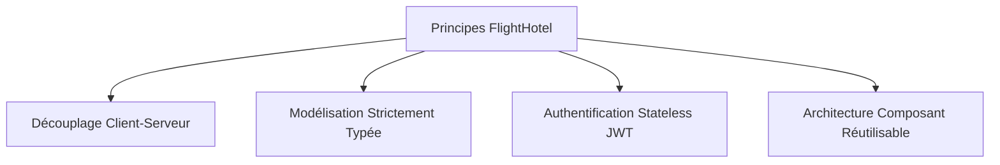
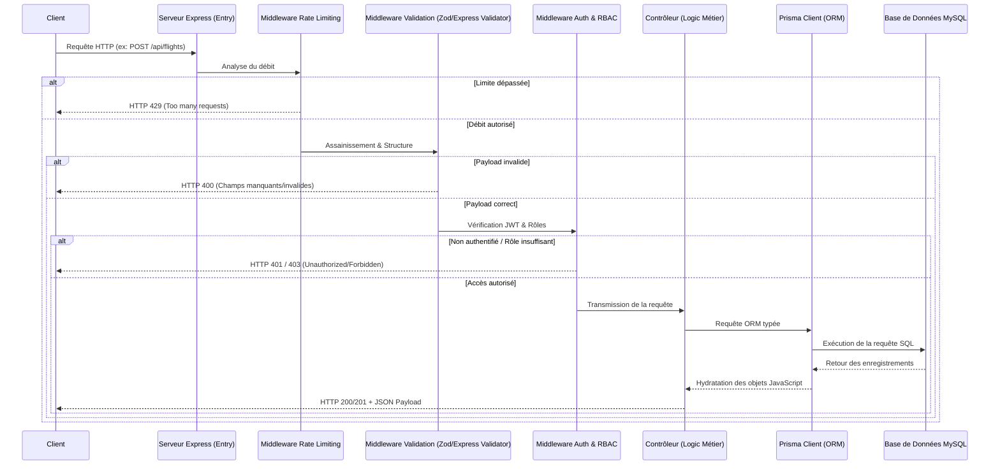
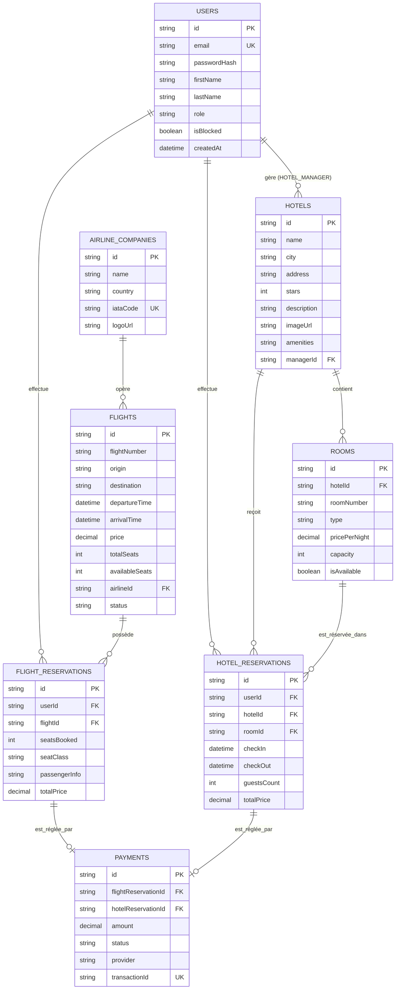
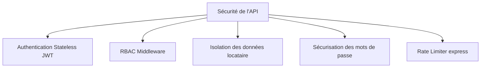
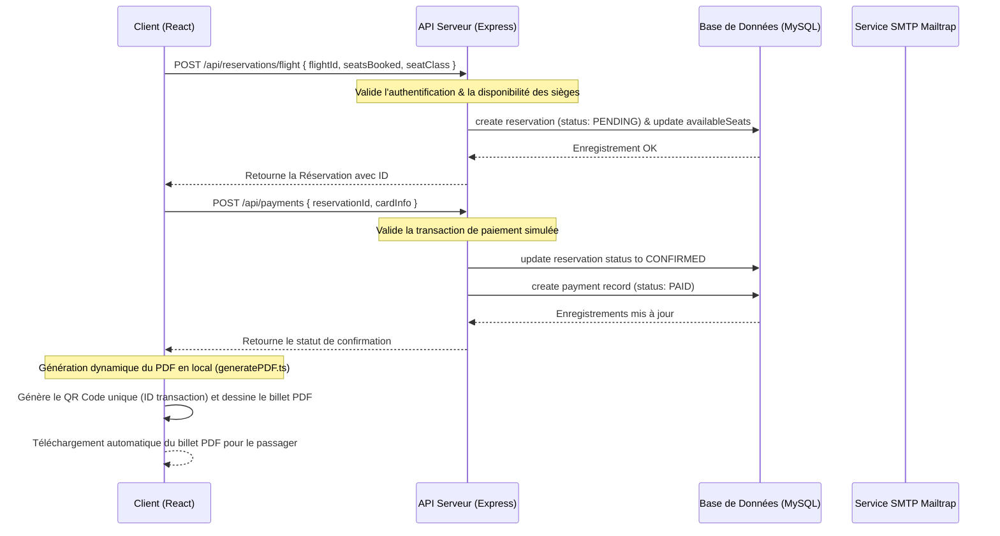

# Rapport d'Architecture Logicielle & Technique

## Projet : Plateforme de Réservation Unifiée - FlightHotel

---

> [!NOTE]  
> Ce document fournit une analyse approfondie et détaillée de l'architecture logicielle, de la modélisation des données, des flux transactionnels, du modèle de sécurité et des choix technologiques de la plateforme **FlightHotel**. Il sert de référence pour la soutenance technique et l'audit du code du PFE.

---

## Table des Matières
1. [Principes Directeurs d'Architecture](#1-principes-directeurs-darchitecture)
2. [Architecture Frontend (Next.js & Zustand)](#2-architecture-frontend-nextjs--zustand)
3. [Architecture Backend (Express & MVC)](#3-architecture-backend-express--mvc)
4. [Modélisation & Architecture de la Base de Données](#4-modélisation--architecture-de-la-base-de-données)
5. [Architecture de Sécurité & RBAC](#5-architecture-de-sécurité--rbac)
6. [Flux Globaux & Diagrammes de Séquence](#6-flux-globaux--diagrammes-de-séquence)
7. [Architecture Réseau & Déploiement](#7-architecture-réseau--déploiement)

---

## 1. Principes Directeurs d'Architecture

La conception de la plateforme **FlightHotel** repose sur quatre piliers d'architecture logicielle :



*   **Découplage strict (Client-Serveur / API-First)** : Le frontend (Next.js) et le backend (Express.js) fonctionnent comme deux applications indépendantes. Ils communiquent exclusivement via des requêtes HTTP asynchrones en échangeant des payloads au format JSON. Cela permet d'envisager un remplacement du client web par une application mobile sans altérer la logique métier backend.
*   **Modélisation strictement typée (TypeScript-First)** : L'ensemble de la base de code (du schéma de base de données aux composants UI) est régie par des types TypeScript ou des définitions Prisma. Les erreurs de structures de données sont ainsi détectées dès la compilation.
*   **Authentification sans état (Stateless)** : Le serveur ne stocke aucune session en mémoire vive. L'identité des requêtes est validée par décryptage de jetons cryptographiques signés (**JSON Web Tokens**).
*   **Performance & Caching** : Réduction du trafic réseau grâce à une synchronisation locale des données (TanStack Query) et à l'exploitation de la mémoire locale du navigateur.

---

## 2. Architecture Frontend (Next.js & Zustand)

Le frontend est construit sous la forme d'une application monopage (SPA) optimisée, propulsée par **Next.js 14+** et structurée avec l'**App Router**.

### Structure des Dossiers Frontend
```text
frontend/
├── app/                  # Système de routage Next.js (Pages & Dispositions)
│   ├── admin/            # Espace d'administration restreint
│   ├── auth/             # Pages d'authentification (login, register, forgot-pass)
│   ├── flights/          # Pages de recherche et réservation de vols
│   ├── hotels/           # Pages de recherche et réservation d'hôtels
│   ├── payment/          # Tunnel de paiement
│   └── profile/          # Profil utilisateur & Historique
├── components/           # Composants UI atomiques et globaux (layout, UI, cards)
├── context/              # Contextes React globaux (ex: LanguageContext pour i18n)
├── lib/                  # Fichiers de configuration client (API Axios, PDFKit)
├── locales/              # Dictionnaires de traduction (FR, EN, AR)
└── stores/               # Stores Zustand (Gestion de l'état global client)
```

### Gestion des États Côté Client
Le client divise sa gestion d'état en deux flux distincts pour optimiser la mémoire et éviter les rendus CPU inutiles :

```mermaid
graph LR
    subgraph Zustand [État Global Local (UI/Session)]
        AuthStore[Session Utilisateur & Tokens]
        UIStore[Menu Mobile & Thèmes]
      style AuthStore fill:#3b82f6,stroke:#1d4ed8,color:#fff
    end

    subgraph ReactQuery [État du Serveur (Données API)]
        Cache[Gestion du cache local]
        Refetch[Rafraîchissement en arrière-plan]
      style Cache fill:#10b981,stroke:#047857,color:#fff
    end
```

1.  **État local persistant (Zustand)** :
    *   Géré par le `authStore.ts`. Il stocke les données de l'utilisateur connecté et son Token JWT.
    *   Il utilise un middleware de persistance (`localStorage`) pour maintenir la session active même après le rafraîchissement de la page par l'utilisateur.
2.  **État du serveur synchronisé (TanStack React Query v5)** :
    *   Toutes les requêtes de données vers l'API (listes d'hôtels, recherches de vols, détails de réservations) passent par React Query.
    *   Les requêtes sont associées à des clés de cache uniques (ex: `['admin-flights', search]`). Les requêtes identiques récupèrent instantanément les données en cache pendant que React Query vérifie en arrière-plan si le serveur a de nouvelles données (*Stale-While-Revalidate*).

### i18n & Support RTL
L'internationalisation utilise un composant enveloppe `LanguageProvider` qui injecte le contexte de langue. Lors de la sélection de la langue Arabe (`ar`), le layout subit une modification instantanée :
```typescript
document.documentElement.dir = 'rtl';
document.documentElement.lang = 'ar';
```
Grâce à Tailwind CSS, les éléments dotés du préfixe `rtl:` (comme `rtl:space-x-reverse`, `rtl:flex-row-reverse`, `rtl:text-right`) s'inversent de manière dynamique, garantissant une ergonomie parfaite pour la lecture de droite à gauche.

---

## 3. Architecture Backend (Express & MVC)

Le serveur API repose sur une architecture en couches (**MVC modifiée**) pour assurer une séparation stricte des responsabilités.

### Pipeline d'Exécution d'une Requête HTTP
Chaque requête entrante suit un cycle de validation rigoureux avant d'atteindre le contrôleur de base de données :



### Rôle des Couches Backend :
1.  **Routeurs (`routes/`)** : Définissent les points d'entrée (Endpoints) de l'API. Ils associent les URLs HTTP aux contrôleurs correspondants et injectent les middlewares requis pour chaque route.
2.  **Middlewares (`middlewares/`)** :
    *   `auth.middleware.ts` : Intercepte les en-têtes HTTP `Authorization: Bearer <token>`, décode le token JWT et injecte l'utilisateur dans l'objet de requête Express (`req.user`).
    *   `role.middleware` (intégré via `authorize()`) : Compare le rôle de l'utilisateur connecté avec les rôles autorisés pour la route (ex: `authorize('ADMIN')`).
3.  **Contrôleurs (`controllers/`)** : Couche d'orchestration. Ils reçoivent les données validées, traitent la logique métier (calculs de prix, vérification de la disponibilité des chambres) et appellent l'ORM.
4.  **Accès aux Données (`lib/prisma.ts` & `prisma/`)** : Fournit une instance unique et globale du client Prisma (Design Pattern Singleton) pour économiser le pool de connexions à la base de données MySQL.

---

## 4. Modélisation & Architecture de la Base de Données

La modélisation de la base de données s'appuie sur une base relationnelle MySQL robuste structurée autour des relations suivantes :



### Choix Techniques de Modélisation
*   **Clés primaires UUIDv4** : L'utilisation de chaînes UUID aléatoires empêche les utilisateurs de deviner l'identifiant des réservations ou d'autres profils via des attaques d'énumération séquentielle.
*   **Cascade référentielle (`onDelete: Cascade`)** : Si un vol ou un hôtel est supprimé par un administrateur, Prisma propage automatiquement la suppression aux réservations associées pour éviter les données orphelines et les clés étrangères invalides en base de données.
*   **Champs JSON stringifiés** : Pour des structures complexes et évolutives (ex: `passengerInfo` dans la réservation de vol pour stocker le nom, prénom et passeport de chaque passager, ou `amenities` dans l'hôtel), les données sont stockées sous forme de chaîne JSON dans un champ texte de type `Text`, optimisant le nombre de tables jointes requises.

---

## 5. Architecture de Sécurité & RBAC

La protection des ressources repose sur un modèle d'accès hybride combinant la validation cryptographique et le cloisonnement basé sur l'identité :



1.  **Authentification par Token JWT** :
    *   Lors de la connexion, le serveur génère un jeton signé contenant l'ID utilisateur, son rôle et sa date d'expiration.
    *   Ce jeton est envoyé dans chaque en-tête de requête HTTP : `Authorization: Bearer <token>`.
2.  **Middleware de rôles (RBAC)** :
    *   Exemple de restriction sur la route de création d'hôtel :
      `router.post('/', authenticate, authorize('HOTEL_MANAGER', 'ADMIN'), createHotel);`
    *   Si le rôle spécifié dans le jeton JWT décodé n'est ni `ADMIN` ni `HOTEL_MANAGER`, Express intercepte la requête et renvoie instantanément un code HTTP `403 Forbidden`.
3.  **Isolation des données** :
    *   Pour éviter qu'un manager d'hôtel puisse voir ou modifier les réservations d'un autre hôtel, les contrôleurs backend filtrent systématiquement les requêtes de base de données en incluant le `managerId` extrait du jeton JWT de la requête.
4.  **Hachage des mots de passe** :
    *   Les mots de passe ne sont jamais stockés en clair. Ils sont chiffrés à l'aide de l'algorithme **bcrypt** avec un facteur de coût (Salt Rounds) de 10 avant leur persistance en base de données.
5.  **Limitation de débit (Rate Limiting)** :
    *   Un middleware limite le nombre maximal d'appels API à 200 requêtes toutes les 15 minutes par adresse IP pour contrer les attaques par déni de service (DDoS) et l'usurpation de force brute sur l'authentification.

---

## 6. Flux Globaux & Diagrammes de Séquence

### Exemple de flux transactionnel : Réservation et Paiement d'un vol

Le diagramme suivant illustre le flux complet de la création d'une réservation à son paiement et à la génération du ticket PDF :



---

## 7. Architecture Réseau & Déploiement

Pour la mise en production, l'infrastructure est orchestrée à l'aide de conteneurs **Docker** garantissant la reproductibilité parfaite du système sur n'importe quel serveur cloud (AWS, DigitalOcean, VPS).

### Schéma de déploiement en conteneurs
```text
                  Internet (Navigateur Client)
                               │ (HTTPS)
                               ▼
                      ┌──────────────────┐
                      │   Reverse Proxy  │ (Nginx)
                      └────────┬─────────┘
                               │
               ┌───────────────┴───────────────┐
               ▼ (HTTP / Port 3000)            ▼ (HTTP / Port 5000)
     ┌──────────────────┐            ┌──────────────────┐
     │  Conteneur Web   │            │  Conteneur API   │
     │     Next.js      │            │    Express.js    │
     └──────────────────┘            └─────────┬────────┘
                                               │ (Port 3306)
                                               ▼
                                     ┌──────────────────┐
                                     │ Conteneur BDD    │
                                     │      MySQL       │
                                     └──────────────────┘
```

*   **Nginx Reverse Proxy** : Fait office de point d'entrée unique. Il gère le chiffrement SSL/TLS (HTTPS) et redirige le trafic réseau vers le conteneur frontend ou backend approprié.
*   **Docker Compose** : Coordonne le démarrage ordonné des conteneurs (la base de données MySQL démarre en premier, suivie des tests de migration Prisma, puis du serveur Express, et enfin du build Next.js).
